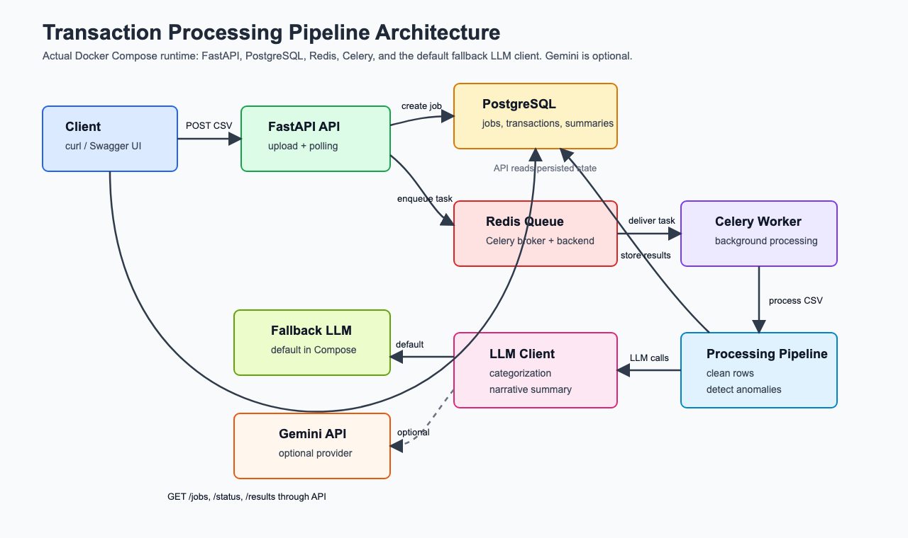
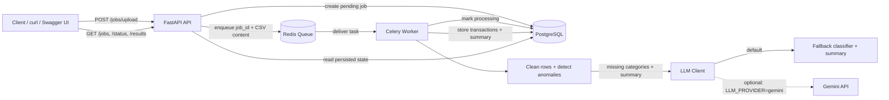

# AI-Powered Transaction Processing Pipeline

A backend and DevOps assignment project built with FastAPI, PostgreSQL, Redis, Celery, and Docker Compose. The system accepts dirty financial transaction CSV files, creates an asynchronous processing job, cleans and normalizes rows, detects anomalies, fills missing categories through an LLM-compatible layer, and returns a structured narrative spending summary.

The project is designed for reviewer execution with no manual setup beyond Docker:

```bash
docker compose up --build
```

No local Python, PostgreSQL, Redis, Celery, migrations, or `.env` file are required for the default run.

## Architecture Overview

The runtime architecture uses an asynchronous queue-backed pipeline:

1. **Client** uploads a CSV and polls job endpoints.
2. **FastAPI API** validates uploads, creates pending jobs, enqueues background work, and serves status/results.
3. **PostgreSQL** stores jobs, cleaned transactions, anomalies, category spend, and summaries.
4. **Redis** acts as the Celery broker/result backend.
5. **Celery Worker** performs CSV cleaning, anomaly detection, LLM classification, and summary generation.
6. **LLM Client** uses the deterministic fallback provider by default. Gemini is supported when explicitly configured.



Editable diagram files:

- [Draw.io source](docs/architecture.drawio)
- [PNG export](docs/architecture.png)
- [SVG source](docs/architecture.svg)
- [Draw.io public editor link](https://app.diagrams.net/#Hadityagaikwad123%2FAI-Powered-Transaction-Processing-Pipeline%2Fmain%2Fdocs%2Farchitecture.drawio#%7B%22pageId%22%3A%222YSpv1Xu4aVf6SPWdunI%22%7D)

## Request Flow



## Features

- CSV upload endpoint returns a `job_id` immediately.
- Background processing runs through Celery and Redis.
- PostgreSQL stores jobs, transactions, anomalies, and summaries.
- Data cleaning handles duplicate rows, mixed date formats, symbols in amounts, casing, missing categories, blank fields, and default values.
- Anomaly detection flags unusually high account spending, USD charges on domestic-only merchants, and suspicious notes.
- Missing categories are classified in batches through an LLM-compatible client.
- Narrative summaries include spend totals, top merchants, anomaly count, category spend, and risk level.
- LLM calls retry up to 3 times with exponential backoff.
- If an external LLM fails, the job continues and affected rows are marked with `llm_failed`.

## Tech Stack

| Layer | Technology |
|---|---|
| API | FastAPI + Uvicorn |
| Database | PostgreSQL 16 |
| Queue | Redis 7 |
| Worker | Celery |
| ORM | SQLAlchemy |
| LLM | Deterministic fallback by default, optional Gemini or Ollama |
| Packaging | Docker + Docker Compose |

## Setup and Installation

### Prerequisite

Install and start Docker Desktop.

### Run the Full Stack

From the project root:

```bash
docker compose up --build
```

This starts:

- `pipline-api-1`: FastAPI API on port `8000`
- `pipline-postgres-1`: PostgreSQL on port `5432`
- `pipline-redis-1`: Redis on port `6379`
- `pipline-worker-1`: Celery worker

The API creates database tables automatically on startup using SQLAlchemy metadata. No migration command is required for this assignment implementation.

### Reset Everything

```bash
docker compose down -v
docker compose up --build
```

This removes the PostgreSQL volume and proves the project can start from scratch without manual setup.

## API Documentation

Interactive Swagger docs:

```text
http://localhost:8000/docs
```

Health check:

```bash
curl http://localhost:8000/health
```

Expected response:

```json
{"status":"ok"}
```

## API Usage

### 1. Upload CSV

```bash
curl -X POST "http://localhost:8000/jobs/upload" \
  -F "file=@sample-data/transactions.csv"
```

Example response:

```json
{
  "job_id": "c8c62dbf-a8c9-4c61-99de-ec98f984cf48",
  "status": "pending"
}
```

### 2. List Jobs

```bash
curl "http://localhost:8000/jobs"
```

Filter by status:

```bash
curl "http://localhost:8000/jobs?status=completed"
```

### 3. Check Job Status

```bash
curl "http://localhost:8000/jobs/{job_id}/status"
```

Example completed response:

```json
{
  "job_id": "c8c62dbf-a8c9-4c61-99de-ec98f984cf48",
  "status": "completed",
  "filename": "transactions.csv",
  "row_count_raw": 95,
  "row_count_clean": 85,
  "error_message": null,
  "summary": {
    "total_spend_inr": "1339923.00",
    "total_spend_usd": "74185.14",
    "top_merchants": [
      {"total": 450697.69, "merchant": "IRCTC"},
      {"total": 270255.97, "merchant": "Jio Recharge"},
      {"total": 227539.88, "merchant": "Flipkart"}
    ],
    "anomaly_count": 22,
    "risk_level": "high"
  }
}
```

### 4. Get Full Results

```bash
curl "http://localhost:8000/jobs/{job_id}/results"
```

The response includes:

- `cleaned_transactions`
- `flagged_anomalies`
- `per_category_spend`
- `llm_summary`

## Pipeline Mechanics

### Data Cleaning

Implemented in `app/processing.py`.

The cleaner:

- Drops exact duplicate rows.
- Parses dates in `%d-%m-%Y`, `%Y/%m/%d`, and `%Y-%m-%d` formats.
- Strips `$` and commas from amounts.
- Converts amounts to two-decimal `Decimal` values.
- Normalizes currency and status to uppercase.
- Converts blank fields to `null`.
- Marks originally missing categories for LLM classification.

### Anomaly Detection

Implemented in `app/processing.py`.

Rules:

1. **Statistical rule**: flag transactions where `amount > 3x` the median amount for that `account_id`.
2. **Merchant/currency rule**: flag USD transactions for domestic-only merchants: `Swiggy`, `Ola`, `IRCTC`, `Zomato`, and `Jio Recharge`.
3. **Notes rule**: flag rows whose notes mention suspicious activity.

### LLM Categorization

Implemented in `app/llm.py` and called from `app/processing.py`.

Rows with missing categories are batched and sent to the LLM client. The default provider is `fallback`, which makes the project deterministic and free to run during review. Optional providers are supported:

```env
LLM_PROVIDER=gemini
GEMINI_API_KEY=your_key
```

```env
LLM_PROVIDER=ollama
OLLAMA_BASE_URL=http://host.docker.internal:11434
OLLAMA_MODEL=llama3.1
```

For the current `docker-compose.yml`, the API and worker are explicitly configured with:

```yaml
LLM_PROVIDER: fallback
```

That is intentional so the reviewer can run the assignment without external credentials.

### LLM Narrative Summary

The summary step produces:

- Total spend by currency
- Top 3 merchants
- Spend by category
- Anomaly count
- Risk level
- Human-readable narrative summary

### Retry Logic

External LLM calls retry up to 3 times with exponential backoff:

```text
attempt 1 -> immediate
attempt 2 -> sleep 1 second
attempt 3 -> sleep 2 seconds
```

If classification still fails, rows are marked `llm_failed`. If summary generation fails, the fallback summary is returned with `llm_failed`.

## Reviewer Verification

The project was tested from a clean Docker volume:

```bash
docker compose down -v
docker compose up --build
```

Then tested:

```bash
curl -X POST "http://localhost:8000/jobs/upload" \
  -F "file=@sample-data/transactions.csv"

curl "http://localhost:8000/jobs"
curl "http://localhost:8000/jobs/{job_id}/status"
curl "http://localhost:8000/jobs/{job_id}/results"
```

Observed result:

```text
status: completed
raw rows: 95
cleaned rows: 85
anomalies: 22
risk_level: high
```

## Production Scale Notes

At 100x traffic, the first bottlenecks would likely be API upload memory, database connection count, worker throughput, Redis queue depth, and external LLM rate limits.

Recommended production improvements:

- Store uploaded files in object storage and pass file references through Redis.
- Add Alembic migrations instead of automatic `create_all`.
- Add PgBouncer for PostgreSQL connection pooling.
- Split queues for CSV parsing and LLM work.
- Add idempotency keys for upload retries.
- Add LLM response caching and provider rate limiting.
- Add metrics and tracing for API latency, queue latency, worker failures, DB pool exhaustion, and provider failures.

