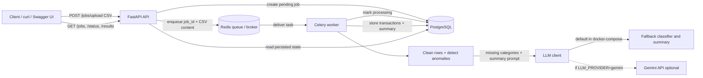

# Architecture

Editable Draw.io source: [`architecture.drawio`](architecture.drawio)

## Actual Runtime Flow

## Request Lifecycle

1. `POST /jobs/upload` validates the CSV, creates a pending job in PostgreSQL, and enqueues `process_transactions(job_id, csv_content)` in Redis.
2. Celery consumes the Redis task, marks the job processing, cleans rows, detects anomalies, classifies missing categories, and generates a narrative summary.
3. The LLM client uses the deterministic fallback by default because `docker-compose.yml` sets `LLM_PROVIDER=fallback`. Gemini is supported when `LLM_PROVIDER=gemini` and `GEMINI_API_KEY` are supplied.
4. The worker stores cleaned transactions and the summary in PostgreSQL.
5. `GET /jobs`, `GET /jobs/{job_id}/status`, and `GET /jobs/{job_id}/results` read persisted state from PostgreSQL.

